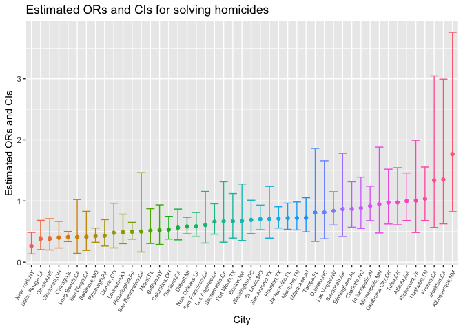
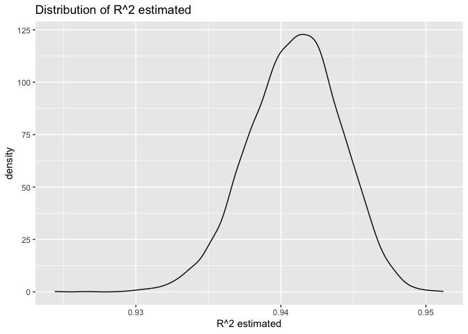
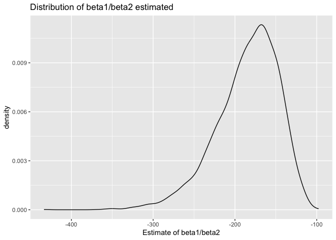
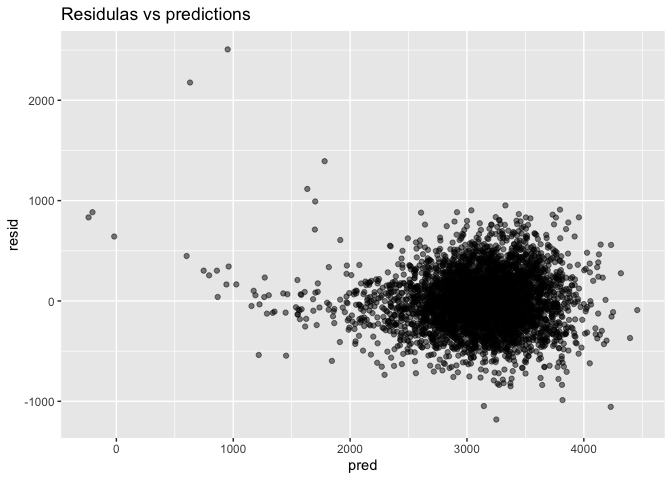

p8105_hw6_hc3653
================
Hongda Chen
2025-12-02

``` r
library(tidyverse)
library(broom)
library(modelr)
```

# Problem 1

``` r
homicide = 
  read.csv("homicide-data(2).csv") %>%
  janitor::clean_names()
```

``` r
homicide_clean = homicide %>%
  mutate(city_state = str_c(city, state, sep = ","),
         solved = if_else(disposition == "Closed by arrest", 1, 0),
         victim_age = as.numeric(victim_age)) %>%
  filter(
    !city_state %in% c("Dallas, TX", "Phoenix, AZ", "Kansas City, MO", "Tulsa, AL"),
    victim_race %in% c("White", "Black")
  )
```

``` r
baltimore = homicide_clean %>%
  filter(city_state == "Baltimore,MD")

baltimore_reg = 
  glm(solved ~ victim_age + victim_sex + victim_race,
      data = baltimore, 
      family = binomial())

baltimore_reg
```

    ## 
    ## Call:  glm(formula = solved ~ victim_age + victim_sex + victim_race, 
    ##     family = binomial(), data = baltimore)
    ## 
    ## Coefficients:
    ##      (Intercept)        victim_age    victim_sexMale  victim_raceWhite  
    ##         0.309981         -0.006727         -0.854463          0.841756  
    ## 
    ## Degrees of Freedom: 2752 Total (i.e. Null);  2749 Residual
    ## Null Deviance:       3568 
    ## Residual Deviance: 3493  AIC: 3501

``` r
baltimore_tidy = 
  broom::tidy(baltimore_reg, conf.int = TRUE, exponentiate = TRUE)

baltimore_OR = baltimore_tidy %>%
  filter(term == "victim_sexMale") %>%
  select(estimate, conf.low, conf.high)

baltimore_OR
```

    ## # A tibble: 1 × 3
    ##   estimate conf.low conf.high
    ##      <dbl>    <dbl>     <dbl>
    ## 1    0.426    0.324     0.558

``` r
unstatisfied_cities =
  homicide_clean %>%
  group_by(city_state) %>%
  summarize(
    sex_levels = n_distinct(victim_sex),
    race_levels = n_distinct(victim_race)
  ) %>%
  filter(sex_levels < 2 | race_levels < 2) %>%
  pull(city_state)

all_cities_clean = homicide_clean %>% filter(!city_state %in% unstatisfied_cities)
```

``` r
all_cities_reg = all_cities_clean %>% 
  nest(data = -city_state) %>%
  mutate(
    model = map(data, ~ glm(
      solved ~ victim_age + victim_sex + victim_race,
      data = .x,
      family = binomial()
    )),
    results = map(model, ~broom::tidy(.x, conf.int = TRUE, exponentiate = TRUE))
  ) %>%
  unnest(results) %>%
  filter(term == "victim_sexMale") %>%
  select(city_state, estimate, conf.low, conf.high)

all_cities_reg
```

    ## # A tibble: 47 × 4
    ##    city_state     estimate conf.low conf.high
    ##    <chr>             <dbl>    <dbl>     <dbl>
    ##  1 Albuquerque,NM    1.77     0.825     3.76 
    ##  2 Atlanta,GA        1.00     0.680     1.46 
    ##  3 Baltimore,MD      0.426    0.324     0.558
    ##  4 Baton Rouge,LA    0.381    0.204     0.684
    ##  5 Birmingham,AL     0.870    0.571     1.31 
    ##  6 Boston,MA         0.674    0.353     1.28 
    ##  7 Buffalo,NY        0.521    0.288     0.936
    ##  8 Charlotte,NC      0.884    0.551     1.39 
    ##  9 Chicago,IL        0.410    0.336     0.501
    ## 10 Cincinnati,OH     0.400    0.231     0.667
    ## # ℹ 37 more rows

``` r
all_cities_plot =  all_cities_reg %>%
  mutate(city_state = fct_reorder(city_state, estimate)) %>%
  ggplot(aes(x = city_state, y = estimate, color = city_state)) +
  geom_point() +
  geom_errorbar(aes(ymin = conf.low, ymax = conf.high)) +
  labs(x = "City",
       y = "Estimated ORs and CIs",
       title = "Estimated ORs and CIs for solving homicides") +
  theme(axis.text.x = element_text(size = 6 , angle = 60, hjust = 1)) +
  theme(legend.position = "none")

all_cities_plot
```

<!-- -->

As we can see from the plot, most cities have ORs smaller than 1, which
means it is more likely to solve homicides of female victims compared to
male victims. Furthermore, some cities like Richmond, VA have wide
confidence intervals, which means a lack of precision in the estimate,
because of small sample size, large standard deviation and etc.

# Problem 2

``` r
library(p8105.datasets)
data("weather_df")

weather = weather_df %>% 
  select(prcp, tmax, tmin) %>%
  drop_na()
```

``` r
slr_model = lm(tmax ~ tmin + prcp, data = weather)

slr_model
```

    ## 
    ## Call:
    ## lm(formula = tmax ~ tmin + prcp, data = weather)
    ## 
    ## Coefficients:
    ## (Intercept)         tmin         prcp  
    ##    7.775638     1.017480    -0.005578

``` r
glance(slr_model)
```

    ## # A tibble: 1 × 12
    ##   r.squared adj.r.squared sigma statistic p.value    df logLik    AIC    BIC
    ##       <dbl>         <dbl> <dbl>     <dbl>   <dbl> <dbl>  <dbl>  <dbl>  <dbl>
    ## 1     0.941         0.941  2.73    17245.       0     2 -5259. 10526. 10549.
    ## # ℹ 3 more variables: deviance <dbl>, df.residual <int>, nobs <int>

``` r
r2 = glance(slr_model)$r.squared

coefs = coef(slr_model)

beta_ratio = coefs["tmin"]/coefs["prcp"]

r2
```

    ## [1] 0.9408579

``` r
beta_ratio
```

    ##      tmin 
    ## -182.4002

``` r
set.seed(1)
n_samp = 5000

bootstrap_results = map_dfr(1:n_samp, ~{
  boot_sample = weather %>% sample_frac(replace = TRUE)
  model = lm(tmax ~ tmin + prcp, data = boot_sample)
  
  r2_bootstrap = glance(model)$r.squared
  coefs_bootstrap = coef(model)
  beta_ratio_bootstrap = coefs_bootstrap["tmin"]/coefs_bootstrap["prcp"]
  
  tibble(r2 = r2_bootstrap, beta_ratio = beta_ratio_bootstrap)
})
```

``` r
ggplot(bootstrap_results, aes(x = r2)) +
  geom_density() +
  labs(x = "R^2 estimated",
       title = "Distribution of R^2 estimated")
```

<!-- -->
From the plot, we can see that the distribution peak at around 0.94,
which means that the predictors explain about 94% of the variation.

``` r
ggplot(bootstrap_results, aes(x = beta_ratio)) +
  geom_density() +
  labs(x = "Estimate of beta1/beta2",
       title = "Distribution of beta1/beta2 estimated")
```

<!-- -->
From the plot, the distribution is left-skewed, peak at about -170, the
distribution overall is not stable.

``` r
CI_results = bootstrap_results %>%
  summarise(
    r2_lower = quantile(r2, 0.025),
    r2_upper = quantile(r2, 0.975),
    beta_ratio_lower = quantile(beta_ratio, 0.025),
    beta_ratio_upper = quantile(beta_ratio, 0.975)
  )
CI_results
```

    ## # A tibble: 1 × 4
    ##   r2_lower r2_upper beta_ratio_lower beta_ratio_upper
    ##      <dbl>    <dbl>            <dbl>            <dbl>
    ## 1    0.934    0.947            -275.            -125.

# Problem 3

``` r
birthweight = read.csv("birthweight.csv") %>%
  janitor::clean_names() %>%
  mutate(
    babysex = factor(babysex, labels = c("male", "female")),
    frace = factor(frace),
    malform = factor(malform, labels = c("absent", "present")),
    mrace = factor(mrace)
  ) %>%
  drop_na()
```

``` r
model = lm(bwt ~ babysex + bhead + blength + delwt + fincome + frace +
                  gaweeks + malform + menarche + mheight + momage + mrace +
                  parity + pnumlbw + pnumsga + ppbmi + ppwt + smoken + wtgain,
           data = birthweight)
summary(model)
```

    ## 
    ## Call:
    ## lm(formula = bwt ~ babysex + bhead + blength + delwt + fincome + 
    ##     frace + gaweeks + malform + menarche + mheight + momage + 
    ##     mrace + parity + pnumlbw + pnumsga + ppbmi + ppwt + smoken + 
    ##     wtgain, data = birthweight)
    ## 
    ## Residuals:
    ##      Min       1Q   Median       3Q      Max 
    ## -1097.68  -184.86    -3.33   173.09  2344.15 
    ## 
    ## Coefficients: (3 not defined because of singularities)
    ##                  Estimate Std. Error t value Pr(>|t|)    
    ## (Intercept)    -6265.3914   660.4011  -9.487  < 2e-16 ***
    ## babysexfemale     28.7073     8.4652   3.391 0.000702 ***
    ## bhead            130.7781     3.4523  37.881  < 2e-16 ***
    ## blength           74.9536     2.0217  37.075  < 2e-16 ***
    ## delwt              4.1007     0.3948  10.386  < 2e-16 ***
    ## fincome            0.2898     0.1795   1.614 0.106551    
    ## frace2            14.3313    46.1501   0.311 0.756168    
    ## frace3            21.2361    69.2960   0.306 0.759273    
    ## frace4           -46.9962    44.6782  -1.052 0.292912    
    ## frace8             4.2969    74.0741   0.058 0.953745    
    ## gaweeks           11.5494     1.4654   7.882 4.06e-15 ***
    ## malformpresent     9.7650    70.6259   0.138 0.890039    
    ## menarche          -3.5508     2.8951  -1.226 0.220083    
    ## mheight            9.7874    10.3116   0.949 0.342588    
    ## momage             0.7593     1.2221   0.621 0.534418    
    ## mrace2          -151.4354    46.0453  -3.289 0.001014 ** 
    ## mrace3           -91.3866    71.9190  -1.271 0.203908    
    ## mrace4           -56.4787    45.1369  -1.251 0.210901    
    ## parity            95.5411    40.4793   2.360 0.018307 *  
    ## pnumlbw                NA         NA      NA       NA    
    ## pnumsga                NA         NA      NA       NA    
    ## ppbmi              4.3538    14.8913   0.292 0.770017    
    ## ppwt              -3.4716     2.6121  -1.329 0.183913    
    ## smoken            -4.8544     0.5871  -8.269  < 2e-16 ***
    ## wtgain                 NA         NA      NA       NA    
    ## ---
    ## Signif. codes:  0 '***' 0.001 '**' 0.01 '*' 0.05 '.' 0.1 ' ' 1
    ## 
    ## Residual standard error: 272.5 on 4320 degrees of freedom
    ## Multiple R-squared:  0.7183, Adjusted R-squared:  0.717 
    ## F-statistic: 524.6 on 21 and 4320 DF,  p-value: < 2.2e-16

``` r
# from the output, some variables with large p values are not appropriate. After removing these variables, we get the main model for this project.
main_model = lm(bwt ~ babysex + bhead + blength + delwt + gaweeks + smoken,
                data = birthweight)
summary(main_model)
```

    ## 
    ## Call:
    ## lm(formula = bwt ~ babysex + bhead + blength + delwt + gaweeks + 
    ##     smoken, data = birthweight)
    ## 
    ## Residuals:
    ##      Min       1Q   Median       3Q      Max 
    ## -1181.20  -183.63    -9.49   174.43  2506.57 
    ## 
    ## Coefficients:
    ##                 Estimate Std. Error t value Pr(>|t|)    
    ## (Intercept)   -6285.7402    97.0521 -64.767  < 2e-16 ***
    ## babysexfemale    30.3364     8.7343   3.473 0.000519 ***
    ## bhead           137.1933     3.5353  38.806  < 2e-16 ***
    ## blength          78.8032     2.0720  38.033  < 2e-16 ***
    ## delwt             2.0766     0.1994  10.416  < 2e-16 ***
    ## gaweeks          14.0748     1.4976   9.398  < 2e-16 ***
    ## smoken           -2.1711     0.5823  -3.729 0.000195 ***
    ## ---
    ## Signif. codes:  0 '***' 0.001 '**' 0.01 '*' 0.05 '.' 0.1 ' ' 1
    ## 
    ## Residual standard error: 282 on 4335 degrees of freedom
    ## Multiple R-squared:  0.6973, Adjusted R-squared:  0.6969 
    ## F-statistic:  1665 on 6 and 4335 DF,  p-value: < 2.2e-16

``` r
bw_pred = birthweight %>%
  add_predictions(main_model) %>%
  add_residuals(main_model)

bw_pred %>%
  ggplot(aes(pred, resid)) +
  geom_point(alpha = 0.5) +
  labs(title = "Residulas vs predictions")
```

<!-- -->

``` r
model_A = lm(bwt ~ blength + gaweeks, data = birthweight)

model_B = lm(bwt ~ (bhead + blength + babysex)^3, data = birthweight)
```

``` r
cv = crossv_mc(birthweight, n = 100)

cv_rmse = function(f, df){
  train = as_tibble(df$train)
  test  = as_tibble(df$test)
  sqrt(mean((test$bwt - predict(f(train), test))^2))
}

results = tibble(
  main = map_dbl(cv$train, ~ cv_rmse(function(d) lm(bwt ~ gaweeks + blength + bhead + babysex + smoken + ppbmi, d), list(train = .x, test = cv$test[[1]]))),
  A = map_dbl(cv$train, ~ cv_rmse(function(d) lm(bwt ~ blength + gaweeks, d), list(train = .x, test = cv$test[[1]]))),
  B = map_dbl(cv$train, ~ cv_rmse(function(d) lm(bwt ~ (bhead + blength + babysex)^3, d), list(train = .x, test = cv$test[[1]])))
)

results %>% summarise(across(everything(), list(mean = mean, sd = sd)))
```

    ## # A tibble: 1 × 6
    ##   main_mean main_sd A_mean  A_sd B_mean  B_sd
    ##       <dbl>   <dbl>  <dbl> <dbl>  <dbl> <dbl>
    ## 1      274.   0.458   309. 0.427   273. 0.467
